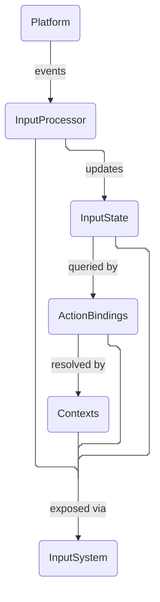

# QuantumInput
#### You only know the inputs state if you observe it

QuantumInput is a modular, context-aware input system for Java applications. It decouples low-level hardware events from high-level gameplay intent through an action-based mapping system and a prioritized context stack.

## Architecture



1.  **Platform**: Connects to hardware APIs (e.g., GLFW, JInput).
2.  **InputProcessor**: Receives raw events and updates the internal state.
3.  **InputState**: Holds the current state of all keys, buttons, and axes.
4.  **ActionBindings**: Maps high-level actions (e.g., "Jump") to specific hardware inputs.
5.  **Contexts**: Manages active action maps based on application state (e.g., Menu vs. Gameplay).
6.  **InputSystem**: The central hub that orchestrates the entire pipeline.

## Getting Started

### 1. Initialize the Input System

QuantumInput uses `ServiceLoader` to discover platform implementations.

```java
// Creates an input system which uses a global input state
InputSystem<GlobalInputState> inputSystem = InputSystem.createGlobalInputSystem();

// Creates an input system which uses a per-device input state
InputSystem<PerDeviceInputState> inputSystem = InputSystem.createPerDeviceInputSystem();
```
The Input state you use is based what the platform supports.

In your main loop, update the system:

```java
while (running) {
    inputSystem.update();
    // ... query inputs ...
}
```

### 2. Define Action Maps

Actions decouple your code from specific keys.

```java
ActionMap gameActions = ActionMapBuilder.create()
    .add("Jump", 32)  // Space key
    .add("Fire", 1)   // Left mouse button
    .build();
```
Keys will usually be provided by your platform of choice, such as `GLFW.GLFW_KEY_SPACE`

### 3. Setup Contexts

Contexts allow you to layer input mappings. Higher priority contexts override lower ones.

```java
InputContextManager contextManager = InputContextManagerBuilder.create()
    .addContext("Game", gameActions, 0)
    .addContext("UI", uiActions, 100)
    .build();

// Activate the contexts as needed
contextManager.pushContext("Game");

// Later, activate a UI context that might override some keys
contextManager.pushContext("UI");

// Deactivate context by name
contextManager.popContext("UI");
```

### 4. Query Actions

Use `ContextActionInput` to check the state of actions resolved through the active contexts.

```java
ContextActionInput actionInput = new ContextActionInput(inputSystem.state(), contextManager);

if (actionInput.isDown(gameActions.getAction("Jump"))) {
    player.jump();
}
```

## Features

- **Decoupled API**: Write your gameplay logic against actions, not key events.
- **Modular Platforms**: Support for most input libraries out of the box.
- **Context-Aware**: Easily switch between UI, Gameplay, and Debugging input states.
- **Polling & Events**: Support for both polling-based queries and event-based listeners.

## Project Structure

- `api`: Core interfaces and abstractions.
- `core`: Default implementation of the input pipeline.
- `modules/action`: Action mapping and binding system.
- `modules/context`: Context stack and resolution logic.
- `platforms`: Hardware-specific implementations.