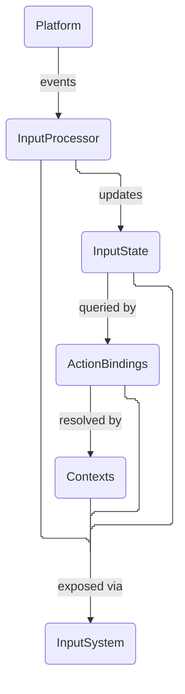

# QuantumInput
#### You only know the inputs state if you observe it

<!--
[Platform]
    ↓ events
[InputProcessor]
    ↓ updates
[InputState]
    ↓ queried by
[ActionBindings]
    ↓ resolved by
[Contexts]
    ↓ exposed via
[InputSystem]

All parts are exposed to InputSystem
-->